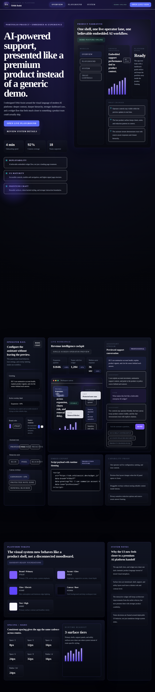
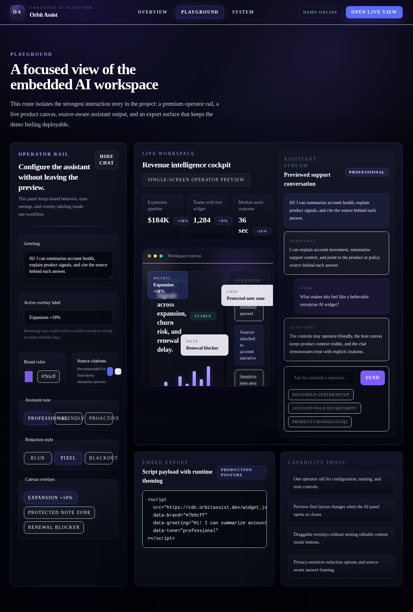
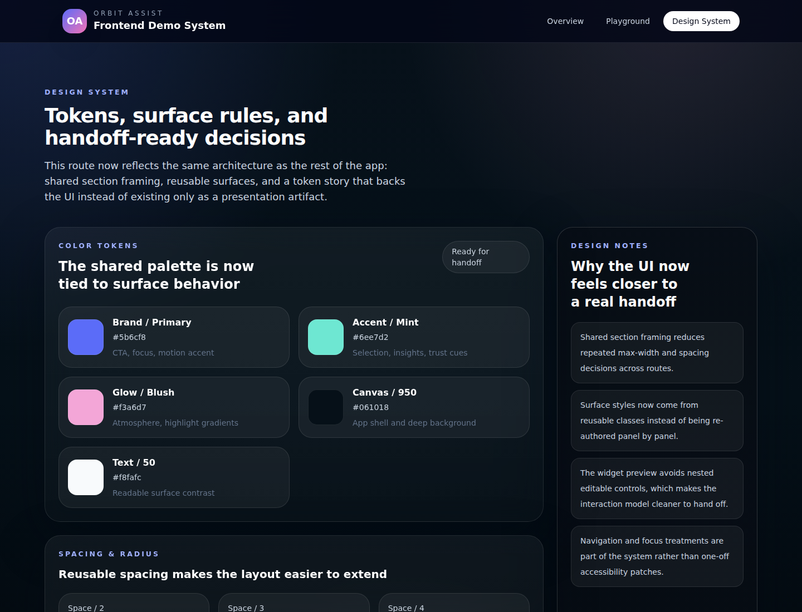
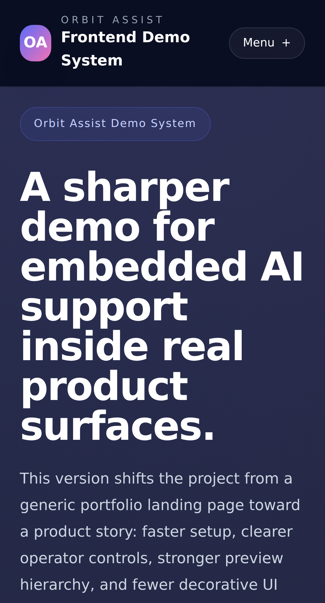

# Orbit Assist Demo

Orbit Assist is a portfolio project for an embedded AI support experience inside a B2B product surface. I built it to demonstrate how I approach product interface work end to end: shaping the concept, defining the UI architecture, designing the interaction model, building the component system, and presenting the result as something that feels credible rather than purely decorative.

This project is not only about frontend implementation. It is also meant to show my skill range across product UX, information hierarchy, design-system thinking, accessibility, responsive behavior, and motion design. I use React and TypeScript to structure the experience, Tailwind CSS to build a reusable visual system, and Framer Motion to add transitions that support hierarchy, state change, and spatial continuity instead of acting as visual noise.

Orbit Assist also illustrates how I think about handoff quality. The repo includes reusable sections, token-driven styling, a configurable widget workflow, preview-first interaction patterns, and visual regression coverage so the project reads like a serious product artifact, not just a one-off landing page.

## Screenshots

### Home Page



### Playground



### Design System



### Mobile View



These screenshots reflect the current visual direction of the project: a darker embedded AI product aesthetic with sharper geometry and a fully local Times New Roman-based type system.

## What I Wanted This Project To Demonstrate

I designed this repo to show that I can:

- build React and TypeScript interfaces with clear component structure
- create polished UI systems with Tailwind CSS and Framer Motion
- design product-led landing and application surfaces, not just marketing pages
- turn a visual concept into reusable sections, tokens, and interaction patterns
- handle AI-adjacent UX details like trust cues, source visibility, and operator controls
- think about accessibility, responsive behavior, and motion in a practical way

## Why I Made It

I wanted a project that communicates my skills from the perspective of an owner, not just a contractor completing a checklist.

Instead of building a generic demo, I focused on a realistic scenario: a non-technical team configuring an embedded assistant inside an existing product. That let me show the decisions I care about most:

- strong information hierarchy
- configuration and preview living in the same workflow
- reusable layout and surface primitives
- motion used for hierarchy and feedback, not noise
- accessibility that is part of the design, not added at the end

## Stack

- React
- TypeScript
- Tailwind CSS
- Framer Motion
- Vite
- Playwright for visual regression coverage

## Routes I Use To Present The Project

- `/` for the overall product story and design direction
- `/playground` for the strongest interaction and configuration flow
- `/design-system` for the token, surface, and handoff angle

## Run Locally

```bash
npm install
npm run dev
```

Then open the local URL printed by Vite, typically `http://localhost:5173`.

## Validation

```bash
npm run typecheck
npm run build
npm run test:visual
```

## Project Structure

```text
src/
  components/
    widget/
      AssistantPreviewPanel.tsx
      HostCanvasPreview.tsx
      WidgetControlPanel.tsx
      WidgetSummaryPanels.tsx
      constants.ts
    AppShell.tsx
    DesignTokenPanel.tsx
    FeatureCardGrid.tsx
    PageSection.tsx
    SectionHeading.tsx
    WidgetSimulator.tsx
  data/
    mockContent.ts
  lib/
    designTokens.ts
    types.ts
  pages/
    DesignSystemPage.tsx
    HomePage.tsx
    PlaygroundPage.tsx
scripts/
  run-vite.mjs
tests/
  visual/
```

## Notes

This is intentionally a frontend-only demonstration project. It does not connect to a live backend or LLM service.

The point of the repo is to show how I think as a frontend owner: how I structure UI, how I shape product flows, how I make interfaces feel credible, and how I support those decisions with maintainable code.
