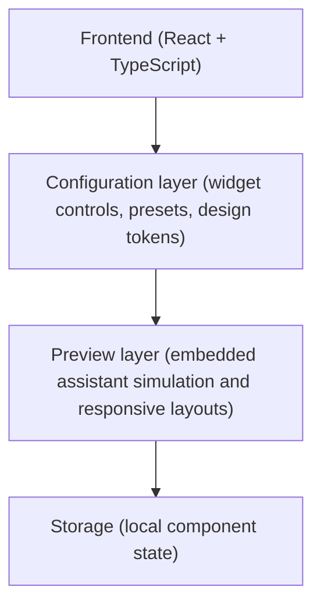

# Orbit Assist Widget

Orbit Assist Widget is a production-style frontend concept for an embedded AI assistant inside a SaaS product. It is designed to show how a configurable support or guidance widget can feel polished, trustworthy, and product-ready across marketing, setup, and interactive preview surfaces.

## What this project demonstrates

- Embedded AI assistant UX designed for real product environments
- Configurable widget flows that combine setup controls with live preview
- Design-system thinking across layout, tokens, motion, and responsiveness
- Frontend implementation that balances polish, accessibility, and reusability

## Use case

This type of system is commonly used for:

- Embedded support assistants in SaaS products
- Guided onboarding and in-app help experiences
- Internal knowledge copilots for operators or account teams
- White-label assistant widgets for software platforms

## Why this matters

This type of system is useful for:

- SaaS products that want embedded AI without building a full standalone app
- Customer experience teams improving onboarding and in-app guidance
- Internal tools that need contextual help directly inside the product surface
- Platforms offering configurable assistant experiences to multiple clients

## Screenshots

### Home Page


### Playground


### Design System


### Mobile View


These screenshots reflect the current visual direction of the project: an embedded AI product aesthetic with a strong visual system, product-led layout, and responsive presentation across desktop and mobile.

## Key capabilities

- Product landing surface that communicates the widget concept clearly
- Playground flow for configuring an embedded assistant experience
- Live preview patterns that help non-technical teams understand the result
- Reusable sections, tokens, and component primitives
- Motion and interaction details that reinforce hierarchy and feedback
- Responsive behavior across marketing and application-style pages

## Architecture overview

This project is a frontend-only product simulation:



Updates happen through:

- Immediate client-side preview changes
- Shared UI tokens and component state

## Stack

- React
- TypeScript
- Tailwind CSS
- Framer Motion
- Vite
- Playwright for visual regression coverage

## Routes I Use To Present The Project

- `/` for the overall product story and design direction
- `/playground` for the strongest interaction and configuration flow
- `/design-system` for the token, surface, and handoff angle

## Run Locally

```bash
npm install
npm run dev
```

Then open the local URL printed by Vite, typically `http://localhost:5173`.

## Validation

```bash
npm run typecheck
npm run build
npm run test:visual
```

## Project Structure

```text
src/
  components/
    widget/
      AssistantPreviewPanel.tsx
      HostCanvasPreview.tsx
      WidgetControlPanel.tsx
      WidgetSummaryPanels.tsx
      constants.ts
    AppShell.tsx
    DesignTokenPanel.tsx
    FeatureCardGrid.tsx
    PageSection.tsx
    SectionHeading.tsx
    WidgetSimulator.tsx
  data/
    mockContent.ts
  lib/
    designTokens.ts
    types.ts
  pages/
    DesignSystemPage.tsx
    HomePage.tsx
    PlaygroundPage.tsx
scripts/
  run-vite.mjs
tests/
  visual/
```

## Notes

This is intentionally a frontend-only demonstration project. It does not connect to a live backend or LLM service.

The focus of the repo is the product experience itself: layout, interaction, handoff quality, and the kind of interface design expected in a modern SaaS environment.
